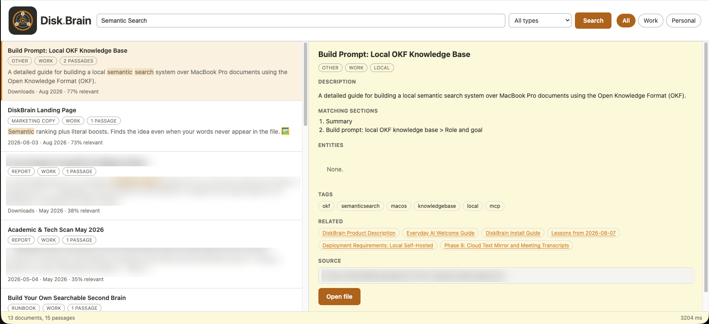

# Disk.Brain

Local semantic search over the documents on your own Mac. You know roughly what a
document said, but not what it was called or where you put it. Disk.Brain finds it
by meaning.

The knowledge layer is a
[Google Open Knowledge Format](https://github.com/GoogleCloudPlatform/knowledge-catalog)
bundle. Retrieval combines vector search, BM25 and a property graph. The finished
system is served over MCP on stdio, so Claude can search your files directly.

Everything runs on your machine. No document content leaves it. There is no
account, no API key and no cloud service in the path.



Two result previews and one file path are blurred above. The corpus behind that
screenshot is a real one, which is rather the point.

## What it does

- Indexes PDF, Word, Excel, PowerPoint, text, markdown, HTML and EPUB.
- Runs Apple Vision OCR over scanned PDFs, judged per page so mixed documents work.
- Has a local model write a title, summary, type, tags and entities for every document.
- Answers a search with vector similarity, BM25 and a graph of shared entities, then reranks.
- Says "nothing here answers that" instead of returning the corpus's nearest miss.
- Serves a one-page search interface on loopback, and three tools over MCP.
- Keeps itself current through an FSEvents watcher and a nightly drain.

## Requirements

- Apple Silicon Mac. The reranker and embeddings run on MLX.
- macOS 14 or later.
- Python 3.12, managed by [uv](https://docs.astral.sh/uv/).
- [Ollama](https://ollama.com) for the enrichment model.
- Disk for the index. Budget roughly 1 GB per 2,000 documents, plus the models.

## Setup

```sh
uv venv --python 3.12
uv pip install -e ".[dev]"
```

Then edit `config.toml`. It is the one file you need to touch. Point `[[scan.roots]]`
at the folders you want searchable and check the denylist before the first run.

```sh
kb doctor              # check roots, binaries and OCR before a long run
kb scan --no-hash      # stat pass only, so you can review what it picked up
kb scan                # walk the roots, record every file, hash what is readable
kb extract             # extract markdown for everything pending
kb enrich              # local model writes a catalogue record per document
kb bundle              # write bundle/ from the enriched records, then validate
kb index               # build the vector store and the BM25 index
kb graph               # build the property graph
kb web                 # search page on http://127.0.0.1:8765
```

`kb enrich` is the long one. It runs a local model over every document and takes
hours on a full corpus, so launch it detached:

```sh
nohup .venv/bin/kb enrich > enrich.log 2>&1 & disown
```

Interrupt it whenever. Rerunning picks up exactly where it stopped. Every command
resumes after an interrupt, and rerunning costs nothing for work already done:
files are keyed by blake3 hash, and a file whose size, mtime and inode are
unchanged is never rehashed.

## Commands

```sh
kb report              # the extraction checkpoint report
kb validate            # check bundle/ against OKF v0.2 conformance
kb samples -n 10       # print whole concept files, spread across types
kb embed-bench         # compare embedding models on held-out sentence probes

kb cypher --list       # show three worked Cypher queries
kb cypher who-appears-most      # run one by name
kb cypher "MATCH (n) RETURN count(n)"   # or run your own

kb search "quarterly revenue"            # vector + BM25 + graph + reranker
kb search "..." --type Runbook --sensitivity work
kb web --port 9000     # serve somewhere else
kb eval --ablation     # hit rate, abstention, per-stage value

kb granola export.json # import Granola meetings, then kb scan && kb drain

kb cockpit init --vault /path/to/vault
kb cockpit capture --vault /path/to/vault --input card.json

kb serve               # MCP server on stdio
kb mcp-config          # the exact JSON for Claude Code and the desktop app

kb watch               # FSEvents watcher: cheap work inline, rest queued
kb drain               # the queued expensive work, capped
kb drain -n 5          # immediate result after changing one file
```

## Searching without Claude

`kb web` serves a one-page search interface on loopback. Results group by document
rather than by passage, each row shows the folder and the month so you can
recognise the thing, and your search terms are highlighted in the preview. Clicking
a result shows the concept and its related concepts, and a button opens the real file.

Every result carries a relevance score, and when nothing scores above
`[retrieve] weak_score` the page says so plainly instead of presenting the
corpus's nearest miss as an answer. That is what the reranker is for, and it is
why a search takes about three seconds rather than half of one. Switching the
reranker off in `config.toml` buys 600 ms and costs you any way of telling a real
answer from the closest thing lying around.

It is read-only. The only thing it can change is which file your Mac has open.
Nothing is served beyond 127.0.0.1 and the page needs no network to render.

## Connecting it to Claude

`kb mcp-config` prints the right block with absolute paths already filled in. In short:

```sh
claude mcp add diskbrain --scope user -- /path/to/checkout/.venv/bin/python -m kb.mcp_server
```

For the desktop app, paste the printed block into
`~/Library/Application Support/Claude/claude_desktop_config.json`.

Three tools: `search_knowledge`, `get_concept`, `traverse`.

## Keeping it current

`scripts/install-agents.sh` installs three LaunchAgents. It rewrites the bundled
plists with your checkout path on the way in, so clone anywhere.

- **watch** runs continuously. Stat, hash, extract, mark deleted. Never touches
  the GPU, so it never competes with anything you are doing.
- **drain** runs at 02:00, capped at `[drain] max_documents`. Enrich, rewrite
  the bundle, reindex the changed concepts, rebuild the graph.
- **web** keeps the search page up and restarts it if it dies.

A deleted file marks its concept `status: deprecated` and drops it from both
indexes. The concept file is never deleted.

## Meetings

`kb granola export.json` turns a Granola meeting export into markdown under
`[granola] notes_dir`, which is a normal scan root. From there `kb scan` and
`kb drain` treat meetings like any other document: no separate pipeline, no
separate store. They land as `type: Meeting Notes` and become searchable by what
was said, not by what the file was called.

Keep the notes directory outside this repo. `*/Disk.Brain/*` is denylisted, so
meetings written inside the project would be saved and then never indexed.

## Obsidian project cockpit

The cockpit keeps concise AI session cards in an Obsidian vault. Obsidian owns
the notes. Disk.Brain indexes them with the rest of the local corpus. Lesson
logs and the candidate ledger remain the reflection record.

Create an empty vault in Obsidian, then initialize it:

```sh
kb cockpit init --vault "/absolute/path/to/vault"
```

The command creates `Projects/`, `Sessions/`, and `Templates/`. It creates
starter files only when absent. It never changes an existing note.

To let the Codex reflection skill capture completed work, create
`~/.config/diskbrain/cockpit.toml`:

```toml
[cockpit]
enabled = true
vault = "/absolute/path/to/vault"
```

No profile means no automatic capture. Set `enabled = false` or remove the
profile to stop new cards. Prior cards remain in the vault.

Add the vault to `config.toml` so Disk.Brain can index it:

```toml
[[scan.roots]]
path = "/absolute/path/to/vault"
enabled = true
sensitivity = "personal"
```

Run `kb scan` after the first setup. The watcher handles later changes, and
`kb drain -n 5` processes queued cards. A manual full rebuild uses `kb scan`,
`kb extract`, `kb enrich`, `kb bundle`, `kb index`, and `kb graph`.

Claude and ChatGPT can produce the same JSON contract with the prompt in
[`docs/obsidian-session-card-prompt.md`](docs/obsidian-session-card-prompt.md).
Capture that JSON with:

```sh
kb cockpit capture --vault "/absolute/path/to/vault" --input card.json
```

## Privacy, and one warning

Everything is local. That is the point. But note what enrichment produces: for
every file in an enabled root, a local model writes a title, a summary of the
contents, the entities it mentions and the full source path, and stores that in
`bundle/`.

That bundle is a map of your disk in plain text. `bundle/` and `data/` are both
gitignored and must stay that way. Read the note in `.gitignore` before you
change it. Treat "enabled = true" on a root as "I am content for a local model to
describe everything in here."

## Layout

```
config.toml       roots, denylist, OCR thresholds. The one file to edit.
src/kb/           the package
bundle/           the OKF bundle. Gitignored, rebuildable with `kb bundle`.
data/             gitignored, disposable, rebuildable
tests/            unit tests plus an end-to-end run on a 20-file fixture
eval/             retrieval eval set. A template. Write your own against your corpus.
DECISIONS.md      every substitution and judgement call, with the reason
ROADMAP.md        what is built, what was dropped, and why
```

## Constraints this build honours

- Read-only against source files. Nothing is written, moved or deleted.
- No Full Disk Access. `~/Library` is out of scope.
- Cloud-evicted files are skipped, not downloaded.
- Python 3.12 under `uv`. Local models only, through Ollama or MLX.

## Tests

```sh
.venv/bin/python -m pytest tests/
```

## Status

The seven core phases are complete and the system is in daily use.

| Phase | What | State |
| --- | --- | --- |
| 1 | Manifest and extraction | done |
| 2 | OKF bundle generation | done |
| 3 | Chunk, embed, index | done |
| 4 | Graph | done |
| 5 | Hybrid retrieval | done |
| 6 | MCP server | done |
| 7 | Incremental updates | done |

Phase 8 is partly done and partly dropped: entities and the retrieval filters are
built, the Granola meeting import is built, and the Google Drive mirror was
dropped on measurement. The detail is in ROADMAP.md.

## License

MIT. See [LICENSE](LICENSE).
